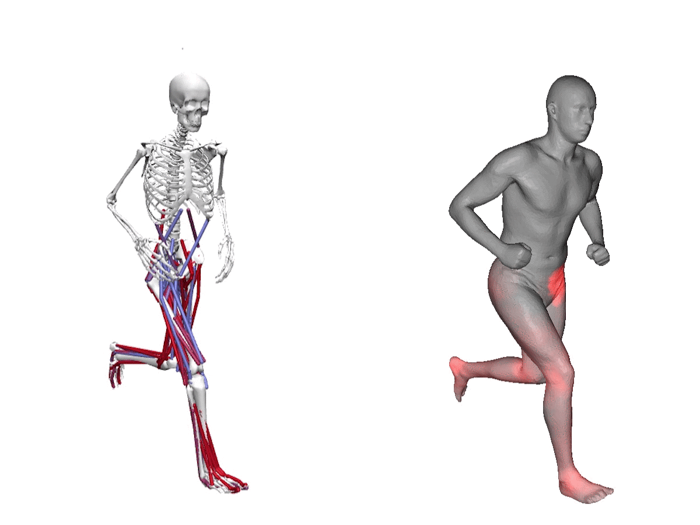

# BASH - Biomechanical Animated Skinned Human

Schleicher, R., Nitschke, M., Martschinke, J., Stamminger, M., Eskofier, B., Klucken, J., Koelewijn, A. (2021).
BASH: Biomechanical Animated Skinned Human for Visualization of Kinematics and Muscle Activity.
16th International Conference on Computer Graphics Theory and Applications (GRAPP), accepted.

# BASH Model
Converting a OpenSim [[1]](#1) format file (.osim + .mot) to the SCAPE [[2]](#2) framework. 
Visualization tool to inspect the animated model in 3D.

## Processing Pipeline
### Input Model: OpenSim
- Parser
 - Model (.osim)
 - Scale factors (.xml)
 - Motion (.mot)
 - Muscle Activation (.sto)

### Baseline model Design for a new Musculoskeltal Model (in Blender)
- modeling
 - import SCAPE mesh
 - rig and skin skeleton (same hierarchy as musucloskeletal model)
 - place markers (same set as musculoskeletal model)
- export model (.dae reorders vertices...) => mesh, markers & weights files

### Scaling
- performed automatically, applied correctly to the hierachy, applied in bone space
- use .xml file or my estimation (defined in settings.h)
- scaled vs generic in ./data/cache/mesh/

### Initial Pose Matching
- computed automatically using OpenSim's IK solver
- cached in ./data/cache/mapping for debugging the resulting .mot file

### Pose Transformation
- calculated beforehand (needed the mesh for projection to SCAPE)
- uses pose mapping projection and kinematic transformations, applied in world space
- cached in ./data/cache/mesh/

### Projection into SCAPE space
- projection to scape space (only relative rotations)
- rigid alignment to adjust translation
- cached in ./data/cache/mesh/

### Visualization of Muscle Activation
- computed at run-time
- color coding in Fragment Shader

## Settings
- settings.h for keyshortcuts, constants and other configurations

## Project structure and dependencies
- SCAPE: The main Windows-Application that handles the model conversion and visualization
 - External dependencies (minimum required version):
  - SFML (>= 2.5.1)
  - glew (>= 2.1.0)
  - glm (>= 0.9.9.5)
  - Assimp (>= 3.0.0)
  - OpenSim and SimbodyTK (>= 4.0)
  
- libRender: A custom framework used for creating a window and render a 3D-application in it
 - External dependencies (minimum required version):
  - SFML (>= 2.5.1)
  - glew (>= 2.1.0)
  - glm (>= 0.9.9.5)
  
- libSCAPE: The SCAPE framework to load the SCAPE binary data and create a mesh in pose and shape
 - External dependencies (minimum required version):
  - SuitSparse package: suitsparse + amd + umfpack (>= 5.1.2)
  - GSL (>= 2.4)

### SCAPE Framework
- Implementation in ´SCAPE.h´
- Model parameters
 - Pose: Rotation vector for each part ('numParts = 16') in three-dimensional twist subvectors (the axis is determined by the vector's direction and the angle is determined by the vector's magnitude.
 - Shape: Scalar PCA coefficients ('numVecs = 20') to modify body proportions like height, size and gender etc.

### Building platform x64
- OpenSim can only be built in 64bit. So we have to use the x64 Platform in order to use their API.
- Include and link all dependencies in x64.
- Build the SCAPE framework in x64.
 - Define the flag '#define SAVE_MATRIX 0' once to write new binaries in the correct format (64bit wording).
 - The folder 'data\default_scape_data' should contain the binary files: 'matrixDGrad.bin', 'SCAPE_DGrad_numeric.bin', 'SCAPE_DGrad_symbolic.bin', 'SCAPE_pose.bin'.

## Example result
OpenSim's visualization compared to our visualization (data set: straight running [[3]](#3)):

## References
<a id="1">[1]</a>
Seth, A., Hicks, J. L., Uchida, T. K., Habib, A., Dembia,C. L., Dunne, J. J., Ong, C. F., DeMers, M. S., Ra-jagopal, A., Millard, M., et al. (2018).
OpenSim: Sim-ulating musculoskeletal dynamics and neuromuscularcontrol to study human and animal movement.
PLoSComputational Biology, 14(7):1–20.

<a id="2">[2]</a> 
Anguelov, D., Srinivasan, P., Koller, D., Thrun, S., Rodgers,J., and Davis, J. (2005).
SCAPE: Shape Completionand Animation of People.
InACM Transactions onGraphics, volume 24, pages 408–416.

<a id="3">[3]</a> 
Nitschke, M., Dorschky, E., Heinrich, D., Schlarb, H., Eskofier, B. M., Koelewijn, A. D., and Van den Bogert, A. J. (2020).
Efficient trajectory optimization for curved running using a 3D musculoskeletal model with implicit dynamics.
Scientific Reports, 10(17655).